# 📚 CodeIgniter 3 Learning Module

  

## 🎯 Selamat Datang di Modul Pembelajaran CodeIgniter 3

Modul ini dirancang khusus untuk **pemula** yang ingin menguasai fundamental framework CodeIgniter 3 dengan pendekatan **praktis** dan **terstruktur**.

---

## 🌟 Mengapa Modul Ini?

<table>
  <tr>
    <td width="50">✅</td>
    <td><strong>Fundamental First</strong> Fokus pada konsep dasar framework, bukan business logic</td>
  </tr>
  <tr>
    <td>🎯</td>
    <td><strong>Practice-Oriented</strong> Setiap materi dilengkapi latihan praktis</td>
  </tr>
  <tr>
    <td>📈</td>
    <td><strong>Progressive Learning</strong> Dari mudah ke kompleks secara bertahap</td>
  </tr>
  <tr>
    <td>🏗️</td>
    <td><strong>Project-Based</strong> Diakhiri dengan mini aplikasi nyata</td>
  </tr>
  <tr>
    <td>🔄</td>
    <td><strong>Dual Response</strong> Belajar membuat Web View & JSON API</td>
  </tr>
</table>

---

## 📖 Apa yang Akan Dipelajari?

### 🔧 **Foundation** (Phase 0-4)
Membangun pondasi yang kuat dengan memahami:
- Environment setup & konfigurasi
- MVC pattern di CodeIgniter 3
- Database operations dengan Query Builder
- Form handling & validation

### 🔒 **Security & State** (Phase 5-6)
Mengamankan aplikasi dengan:
- Input filtering & XSS protection
- CSRF protection
- Session management
- Authentication system

### ⚡ **Advanced Features** (Phase 7-11)
Meningkatkan kemampuan dengan:
- Custom helper & library
- File upload handling
- Dual response (Web & API)
- Pagination, search & filter
- Error handling & debugging

### 🚀 **Final Project** (Phase 12)
Implementasi semua konsep dalam:
- **Aplikasi Keuangan Pribadi**
- CRUD transaksi income/expense
- Dashboard dengan rekap bulanan
- RESTful API endpoints

---

## 👥 Untuk Siapa Modul Ini?

  

    <h4>✅ Cocok Untuk:</h4>
    <ul>
      <li>Pemula yang sudah paham PHP dasar</li>
      <li>Developer yang ingin belajar CI3</li>
      <li>Mahasiswa/siswa IT</li>
      <li>Self-learner yang suka praktik</li>
    </ul>
  

  

    <h4>⚠️ Perlu Persiapan:</h4>
    <ul>
      <li>Belum pernah coding</li>
      <li>Tidak paham HTML/CSS</li>
      <li>Tidak familiar dengan database</li>
      <li>Mencari advanced topics</li>
    </ul>
  

---

## 🗺️ Learning Path

```mermaid
graph LR
    A[🎯 Start] --> B[📋 Prerequisite]
    B --> C[⚙️ Setup]
    C --> D[🎮 Controller]
    D --> E[👁️ View]
    E --> F[💾 Model]
    F --> G[📝 Form]
    G --> H[🔒 Security]
    H --> I[🔑 Auth]
    I --> J[📦 Helper]
    J --> K[📤 Upload]
    K --> L[🔄 API]
    L --> M[📊 Data]
    M --> N[🐛 Debug]
    N --> O[🚀 Project]
    O --> P[🎉 Finish]
```

---

## 📚 Cara Menggunakan Modul

### 1️⃣ **Sequential Learning**
Ikuti urutan phase dari awal hingga akhir. Setiap phase membangun di atas phase sebelumnya.

### 2️⃣ **Practice First**
Setelah membaca materi, langsung praktikkan. Jangan lanjut sebelum berhasil menjalankan practice.

### 3️⃣ **Test Yourself**
Jawab quiz di akhir setiap phase untuk memastikan pemahaman.

### 4️⃣ **Build Project**
Terapkan semua yang dipelajari dalam mini project di akhir.

---

## ⏱️ Estimasi Waktu Belajar

| Phase | Topik | Estimasi |
|-------|-------|----------|
| **Foundation** | Prerequisite - Phase 4 | 2-3 minggu |
| **Intermediate** | Phase 5 - Phase 9 | 3-4 minggu |
| **Advanced** | Phase 10 - Phase 11 | 1-2 minggu |
| **Project** | Phase 12 | 2-3 minggu |
| | **Total** | **8-12 minggu** |

> 💡 **Tips:** Dedikasikan minimal 2-3 jam per hari untuk hasil optimal

---

## 🛠️ Tools yang Dibutuhkan

Sebelum memulai, pastikan sudah menginstall:

- **Local Server:** XAMPP / Laragon / MAMP
- **Code Editor:** VS Code (recommended)
- **Browser:** Chrome/Firefox dengan DevTools
- **API Testing:** Postman
- **Version Control:** Git (optional tapi recommended)

---

## 📝 Konvensi yang Digunakan

Dalam modul ini, kita menggunakan beberapa konvensi untuk memudahkan pembelajaran:

| Simbol | Arti |
|--------|------|
| 📌 | Poin penting untuk diingat |
| ⚠️ | Peringatan atau hal yang harus dihindari |
| 💡 | Tips atau best practice |
| 🔧 | Hands-on practice |
| 📝 | Catatan tambahan |
| ✅ | Checklist atau validasi |
| 🎯 | Tujuan pembelajaran |

---

## 🤝 Kontribusi & Feedback

Modul ini terus dikembangkan. Jika menemukan:
- ❌ Error atau typo
- 💭 Bagian yang kurang jelas
- 💡 Ide untuk improvement

Silakan berikan feedback untuk perbaikan modul ini.

---

## 🚀 Mari Mulai!

Siap untuk memulai perjalanan belajar CodeIgniter 3? 

**[▶️ Mulai dari Prerequisite →](prerequisite/README.md)**

---

  <strong>Happy Coding! 🎉</strong> 
  <em>Remember: The expert in anything was once a beginner</em>

