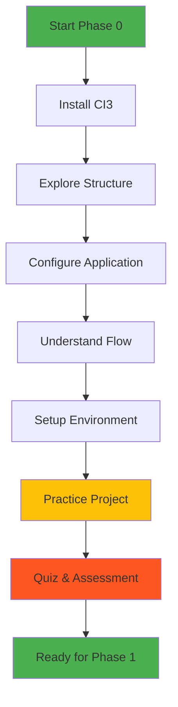

# ⚙️ Phase 0 - Environment & Setup

## 🎯 Learning Objectives

Setelah menyelesaikan phase ini, Anda akan:
- ✅ Mampu menginstall dan menjalankan CodeIgniter 3
- ✅ Memahami struktur folder dan file CI3
- ✅ Menguasai konfigurasi dasar aplikasi
- ✅ Memahami alur request-response di CI3
- ✅ Mengatur environment untuk development dan production

---

## 📋 Overview

Phase ini adalah **fondasi utama** sebelum mulai coding dengan CodeIgniter 3. Kita akan setup environment, memahami struktur, dan konfigurasi yang diperlukan.

> 💡 **Fun Fact:** CodeIgniter 3 sangat ringan, hanya ~2MB dalam keadaan fresh install!

---

## 🗺️ What We'll Cover

<div style="display: grid; grid-template-columns: repeat(auto-fit, minmax(250px, 1fr)); gap: 20px; margin: 20px 0;">
  
  <div style="border: 2px solid #4CAF50; border-radius: 10px; padding: 20px;">
    <h3>📥 Installation</h3>
    <p>Download dan setup CI3 di local server</p>
  </div>
  
  <div style="border: 2px solid #2196F3; border-radius: 10px; padding: 20px;">
    <h3>📁 Project Structure</h3>
    <p>Memahami setiap folder dan fungsinya</p>
  </div>
  
  <div style="border: 2px solid #FF9800; border-radius: 10px; padding: 20px;">
    <h3>⚡ Configuration</h3>
    <p>Setup config, database, dan autoload</p>
  </div>
  
  <div style="border: 2px solid #9C27B0; border-radius: 10px; padding: 20px;">
    <h3>🔄 Request Flow</h3>
    <p>Bagaimana CI3 memproses request</p>
  </div>
  
  <div style="border: 2px solid #F44336; border-radius: 10px; padding: 20px;">
    <h3>🌍 Environment</h3>
    <p>Development vs Production mode</p>
  </div>
  
  <div style="border: 2px solid #00BCD4; border-radius: 10px; padding: 20px;">
    <h3>🔧 Practice</h3>
    <p>Hands-on setup project pertama</p>
  </div>
  
</div>

---

## 🎓 Why This Phase Matters

### 🏗️ Foundation Building
Seperti membangun rumah, fondasi yang kuat menentukan kekuatan struktur di atasnya. Setup yang benar di awal akan menghindarkan masalah di kemudian hari.

### 🗺️ Navigation Skills
Memahami struktur folder = tahu di mana harus meletakkan kode. Ini crucial untuk development yang efisien.

### ⚙️ Configuration Mastery
Banyak "magic" di CI3 sebenarnya berasal dari konfigurasi. Pahami ini, dan Anda menguasai setengah dari CI3.

### 🔍 Debugging Power
Ketika terjadi error, pemahaman tentang flow dan structure akan membantu debug dengan cepat.

---

## 📊 Phase Structure



---

## 🎯 Learning Path

### 📚 Theory (40%)
- Konsep MVC di CodeIgniter
- Struktur dan organisasi file
- Configuration best practices
- Environment management

### 💻 Practice (60%)
- Install dan run CI3
- Explore setiap folder
- Modify configurations
- Create first page
- Test different environments

---

## ⚡ Quick Preview

Berikut preview apa yang akan kita pelajari:

### 1. **Installation** - Dari download hingga "Welcome to CodeIgniter"
```bash
# Download CI3
# Extract ke htdocs/www
# Akses http://localhost/ci3-app
# Lihat welcome page
```

### 2. **Structure** - Mengenal rumah baru kita
```
codeigniter3/
├── application/      # 🏠 Tempat kita coding
├── system/          # 🔧 Core framework (don't touch)
├── index.php        # 🚪 Entry point
└── .htaccess        # 🛡️ URL rewriting
```

### 3. **Configuration** - Setting up aplikasi
```php
// Base URL
$config['base_url'] = 'http://localhost/myapp/';

// Remove index.php
$config['index_page'] = '';

// Database connection
$db['default']['hostname'] = 'localhost';
$db['default']['username'] = 'root';
```

### 4. **Flow** - Perjalanan request
```
User Request → index.php → Routing → Controller → Model → View → Response
```

### 5. **Environment** - Dev vs Production
```php
// index.php
define('ENVIRONMENT', 'development'); // atau 'production'
```

---

## 🛠️ Prerequisites Check

Sebelum mulai, pastikan sudah ready:

| Requirement | Check | Action if Missing |
|-------------|-------|-------------------|
| Local Server | ✅ | Install XAMPP/Laragon |
| PHP >= 5.6 | ✅ | Update PHP version |
| MySQL | ✅ | Include in XAMPP |
| Browser | ✅ | Chrome/Firefox |
| Code Editor | ✅ | Install VS Code |
| Internet | ✅ | Untuk download CI3 |

---

## 📝 What You'll Build

Di akhir phase ini, Anda akan memiliki:

1. **Working CI3 Installation**
   - Clean URL (tanpa index.php)
   - Database connected
   - Custom welcome page

2. **Understanding of:**
   - Every folder's purpose
   - Configuration options
   - Request lifecycle
   - Environment switching

3. **First Custom Page:**
   - Custom controller
   - Custom view
   - Proper routing

---

## 🎯 Success Criteria

Anda berhasil menyelesaikan Phase 0 jika:

- [ ] CI3 berjalan di localhost
- [ ] Bisa menjelaskan fungsi setiap folder
- [ ] Berhasil konfigurasi base_url dan database
- [ ] Memahami alur request → response
- [ ] Bisa switch environment dev/production
- [ ] Membuat halaman custom pertama
- [ ] Lulus quiz dengan score ≥ 80%

---

## 🚀 Ready to Start?

Mari mulai perjalanan CodeIgniter 3 dengan instalasi!

<div style="display: flex; justify-content: space-between; margin-top: 40px;">
  <div>
    <a href="../prerequisite/README.md" style="text-decoration: none;">
      <button style="background: #6c757d; color: white; padding: 10px 20px; border: none; border-radius: 5px; cursor: pointer;">
        ← Previous: Prerequisites
      </button>
    </a>
  </div>
  <div>
    <a href="installation.md" style="text-decoration: none;">
      <button style="background: #4CAF50; color: white; padding: 10px 20px; border: none; border-radius: 5px; cursor: pointer;">
        Next: Installing CodeIgniter 3 →
      </button>
    </a>
  </div>
</div>

---

## 📚 Phase Contents

1. **[📥 Installing CodeIgniter 3](installation.md)**  
   Download, extract, dan menjalankan CI3 pertama kali

2. **[📁 Project Structure](structure.md)**  
   Deep dive ke setiap folder dan file penting

3. **[⚡ Configuration](configuration.md)**  
   Setup config.php, database.php, autoload.php

4. **[🔄 Request Flow](request-flow.md)**  
   Memahami lifecycle request di CI3

5. **[🌍 Environment Settings](environment.md)**  
   Development, testing, dan production mode

6. **[🔧 Practice Lab](practice.md)**  
   Hands-on exercise membuat project pertama

7. **[❓ Quiz](quiz.md)**  
   Test pemahaman Anda tentang Phase 0

---

<p align="center">
  <em>"The journey of a thousand miles begins with a single step" - Lao Tzu</em><br/>
  <strong>Your first step starts here! 🚀</strong>
</p>
