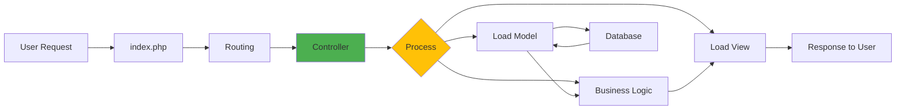

# 🎮 Phase 1 - Controller & Routing

## 🎯 Learning Objectives

Setelah menyelesaikan phase ini, Anda akan:
- ✅ Memahami konsep Controller di MVC pattern
- ✅ Membuat dan mengorganisir Controllers
- ✅ Menguasai routing system di CI3
- ✅ Menangani URL parameters
- ✅ Loading resources (model, view, helper, library)
- ✅ Memahami lifecycle request di Controller

---

## 📋 Overview

Controller adalah **jantung aplikasi** CodeIgniter 3. Semua logic aplikasi dimulai dari sini. Controller menerima request, memproses, dan menentukan response.

> 💡 **Analogi Sederhana:**  
> Controller = **Pelayan restoran** 🧑‍🍳  
> - Menerima pesanan (request)
> - Koordinasi dengan dapur (model)  
> - Menyajikan makanan (view)

---

## 🎭 Controller vs PHP Native

### PHP Native Approach:
```php
// product.php
<?php
// Semua logic dalam 1 file
$id = $_GET['id'];
$conn = mysqli_connect(...);
$result = mysqli_query($conn, "SELECT * FROM products WHERE id = $id");
$product = mysqli_fetch_assoc($result);
?>
<h1><?= $product['name'] ?></h1>
```

### CodeIgniter 3 Approach:
```php
// Controller (application/controllers/Product.php)
class Product extends CI_Controller {
    public function detail($id) {
        $data['product'] = $this->product_model->get($id);
        $this->load->view('product_detail', $data);
    }
}
```

**Keuntungan CI3:**
- ✅ Separation of Concerns
- ✅ Reusable code
- ✅ Clean URLs
- ✅ Easy maintenance
- ✅ Scalable structure

---

## 🗺️ What We'll Learn

<div style="display: grid; grid-template-columns: repeat(auto-fit, minmax(200px, 1fr)); gap: 15px; margin: 20px 0;">
  
  <div style="background: linear-gradient(135deg, #667eea 0%, #764ba2 100%); color: white; padding: 20px; border-radius: 10px;">
    <h4>🎯 Controller Basics</h4>
    <small>Konsep, struktur, naming</small>
  </div>
  
  <div style="background: linear-gradient(135deg, #f093fb 0%, #f5576c 100%); color: white; padding: 20px; border-radius: 10px;">
    <h4>🏗️ Anatomy</h4>
    <small>Class, methods, constructor</small>
  </div>
  
  <div style="background: linear-gradient(135deg, #4facfe 0%, #00f2fe 100%); color: white; padding: 20px; border-radius: 10px;">
    <h4>🔧 Methods</h4>
    <small>Public, private, parameters</small>
  </div>
  
  <div style="background: linear-gradient(135deg, #43e97b 0%, #38f9d7 100%); color: white; padding: 20px; border-radius: 10px;">
    <h4>🛣️ Routing</h4>
    <small>URL mapping, custom routes</small>
  </div>
  
  <div style="background: linear-gradient(135deg, #fa709a 0%, #fee140 100%); color: white; padding: 20px; border-radius: 10px;">
    <h4>📦 Resources</h4>
    <small>Load model, view, library</small>
  </div>
  
  <div style="background: linear-gradient(135deg, #30cfd0 0%, #330867 100%); color: white; padding: 20px; border-radius: 10px;">
    <h4>💻 Practice</h4>
    <small>Real-world examples</small>
  </div>
  
</div>

---

## 🔄 Request Flow in Controller



---

## 📊 Controller Responsibilities

### ✅ What Controller SHOULD Do:
- Receive and validate requests
- Call models for data
- Process business logic
- Load appropriate views
- Handle user sessions
- Manage redirects
- Return responses (HTML/JSON)

### ❌ What Controller SHOULD NOT Do:
- Direct database queries (use Model)
- HTML generation (use View)
- Complex calculations (use Library)
- Styling/JavaScript (use View)

---

## 🎯 Real-World Examples

### Example 1: Blog Controller
```php
class Blog extends CI_Controller {
    // List all posts
    public function index() { }
    
    // Show single post
    public function post($slug) { }
    
    // Create new post
    public function create() { }
    
    // Edit post
    public function edit($id) { }
    
    // Delete post
    public function delete($id) { }
}
```

### Example 2: User Controller
```php
class User extends CI_Controller {
    // User profile
    public function profile($username) { }
    
    // User settings
    public function settings() { }
    
    // Update profile
    public function update() { }
}
```

### Example 3: API Controller
```php
class Api extends CI_Controller {
    // Return JSON response
    public function users() {
        $users = $this->user_model->get_all();
        $this->output
            ->set_content_type('application/json')
            ->set_output(json_encode($users));
    }
}
```

---

## 🛠️ Tools & Techniques

### 1. **URL Structure**
```
http://localhost/ci3/[controller]/[method]/[param1]/[param2]
                      ↓           ↓         ↓         ↓
                    class      function  arguments
```

### 2. **Auto-loading Resources**
Instead of loading in each method:
```php
// application/config/autoload.php
$autoload['helper'] = array('url', 'form');
$autoload['libraries'] = array('database', 'session');
```

### 3. **Constructor Usage**
```php
class Product extends CI_Controller {
    public function __construct() {
        parent::__construct();
        // Load once, use everywhere in this controller
        $this->load->model('product_model');
        $this->load->helper('url');
    }
}
```

---

## 📈 Learning Progress

Dalam Phase 1 ini, kita akan cover:

| Topic | Difficulty | Time |
|-------|------------|------|
| Controller Concept | ⭐⭐ | 30 min |
| Controller Anatomy | ⭐⭐ | 45 min |
| Methods & Parameters | ⭐⭐⭐ | 45 min |
| Routing System | ⭐⭐⭐ | 60 min |
| Loading Resources | ⭐⭐ | 30 min |
| Practice Lab | ⭐⭐⭐ | 90 min |
| Quiz | ⭐⭐⭐ | 30 min |

**Total: ~5 hours**

---

## 🎯 Success Metrics

Anda berhasil menguasai Phase 1 jika bisa:

- [ ] Menjelaskan peran Controller di MVC
- [ ] Membuat Controller dengan multiple methods
- [ ] Menghandle URL parameters
- [ ] Membuat custom routes
- [ ] Load dan use resources (model, view, helper)
- [ ] Membedakan public vs private methods
- [ ] Debug Controller issues
- [ ] Score ≥ 80% di quiz

---

## 🚀 What You'll Build

Di akhir phase ini, Anda akan membuat:

### Mini Project: "Product Catalog"
```
Features:
✅ Product list page
✅ Product detail page
✅ Category filtering
✅ Search functionality
✅ Custom URLs
✅ Error handling
```

---

## 💡 Pro Tips untuk Phase 1

### Tip 1: Naming Convention
```php
// ✅ Good
class Product_category extends CI_Controller { }  // File: Product_category.php

// ❌ Bad
class productcategory extends CI_Controller { }   // Inconsistent
class PRODUCT extends CI_Controller { }           // All caps
```

### Tip 2: RESTful Methods
```php
class Product extends CI_Controller {
    public function index() { }      // GET /product
    public function show($id) { }    // GET /product/show/1
    public function create() { }     // GET /product/create
    public function store() { }      // POST /product/store
    public function edit($id) { }    // GET /product/edit/1
    public function update($id) { }  // POST /product/update/1
    public function destroy($id) { } // POST /product/destroy/1
}
```

### Tip 3: Error Handling
```php
public function detail($id = null) {
    if (!$id) {
        show_404();  // Built-in 404 page
    }
    
    $product = $this->product_model->get($id);
    if (!$product) {
        show_error('Product not found', 404);
    }
}
```

---

## 📚 Phase Contents

Ready untuk dive deeper? Mari mulai dengan:

1. **[🎯 Understanding Controllers](controller-concept.md)**  
   Konsep dasar dan filosofi Controller

2. **[🏗️ Controller Anatomy](controller-anatomy.md)**  
   Struktur dan komponen Controller

3. **[🔧 Methods & Parameters](methods-parameters.md)**  
   Public, private methods dan parameter handling

4. **[🛣️ Routing System](routing.md)**  
   URL mapping dan custom routes

5. **[📦 Loading Resources](loading-resources.md)**  
   Load model, view, helper, library

6. **[💻 Practice Lab](practice.md)**  
   Hands-on exercises

7. **[❓ Quiz](quiz.md)**  
   Test your knowledge

---

## 🎯 Ready to Master Controllers?

Controllers adalah fondasi aplikasi CI3. Master this, and you master half of CI3!

<div style="display: flex; justify-content: space-between; margin-top: 40px;">
  <div>
    <a href="../phase-0-setup/quiz.md" style="text-decoration: none;">
      <button style="background: #6c757d; color: white; padding: 10px 20px; border: none; border-radius: 5px; cursor: pointer;">
        ← Previous: Phase 0 Quiz
      </button>
    </a>
  </div>
  <div>
    <a href="controller-concept.md" style="text-decoration: none;">
      <button style="background: #4CAF50; color: white; padding: 10px 20px; border: none; border-radius: 5px; cursor: pointer;">
        Next: Understanding Controllers →
      </button>
    </a>
  </div>
</div>

---

<p align="center">
  <strong>🎮 Let's take control with Controllers!</strong><br/>
  <em>"The controller is where the magic happens"</em>
</p>
