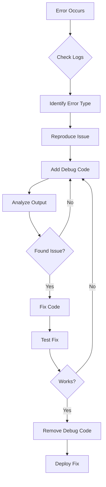

# 🐛 Phase 11 - Error Handling & Debugging

## 🎯 Learning Objectives

Setelah menyelesaikan phase ini, Anda akan:
- ✅ Menguasai error handling di CI3
- ✅ Implementasi logging system
- ✅ Create custom error pages
- ✅ Debug aplikasi secara efektif
- ✅ Use profiler untuk optimization
- ✅ Handle exceptions properly

---

## 📋 Overview

Error handling dan debugging adalah skills critical untuk development dan maintenance. Phase ini fokus pada tools dan techniques untuk identify, log, dan fix issues.

> 💡 **Analogi Sederhana:**  
> Error handling adalah **sistem alarm kebakaran** 🚨. Debugging adalah **detektif** 🕵️ yang mencari penyebab masalah!

---

## 🗺️ What We'll Learn

<div style="display: grid; grid-template-columns: repeat(auto-fit, minmax(200px, 1fr)); gap: 15px; margin: 20px 0;">
  
  <div style="background: #FFEBEE; border-left: 4px solid #F44336; padding: 15px;">
    <h4>🚨 Error Handling</h4>
    <small>Catch & manage errors</small>
  </div>
  
  <div style="background: #E8F5E9; border-left: 4px solid #4CAF50; padding: 15px;">
    <h4>📝 Logging</h4>
    <small>Track issues</small>
  </div>
  
  <div style="background: #E3F2FD; border-left: 4px solid #2196F3; padding: 15px;">
    <h4>🎨 Error Pages</h4>
    <small>Custom 404, 500</small>
  </div>
  
  <div style="background: #FFF3E0; border-left: 4px solid #FF9800; padding: 15px;">
    <h4>🔍 Debugging</h4>
    <small>Find & fix bugs</small>
  </div>
  
  <div style="background: #F3E5F5; border-left: 4px solid #9C27B0; padding: 15px;">
    <h4>📊 Profiler</h4>
    <small>Performance analysis</small>
  </div>
  
  <div style="background: #E0F7FA; border-left: 4px solid #00BCD4; padding: 15px;">
    <h4>⚡ Optimization</h4>
    <small>Speed improvements</small>
  </div>
  
</div>

---

## 📚 Phase Contents

### Core Topics
1. **[🚨 Error Handling Basics](error-basics.md)**
   - Error types
   - Error reporting levels
   - Environment-based handling

2. **[📝 Logging System](logging.md)**
   - Log levels
   - Log messages
   - Log file management

3. **[🎨 Custom Error Pages](error-pages.md)**
   - 404 pages
   - Database errors
   - General errors

4. **[🔍 Debugging Techniques](debugging.md)**
   - Debug helpers
   - Var_dump alternatives
   - Stack traces

5. **[⚠️ Exception Handling](exceptions.md)**
   - Try-catch blocks
   - Custom exceptions
   - Error recovery

### Advanced Topics
6. **[📊 CI3 Profiler](profiler.md)**
   - Enable profiler
   - Analyze queries
   - Memory usage

7. **[🔧 Debug Tools](debug-tools.md)**
   - Xdebug setup
   - Browser DevTools
   - Query debugging

8. **[⚡ Performance Debug](performance.md)**
   - Slow query detection
   - Memory leaks
   - Optimization tips

### Practice & Assessment
9. **[💻 Practice Lab](practice.md)**
   - Debug real issues
   - Implement logging

10. **[❓ Quiz](quiz.md)**
    - Test your knowledge
    - 10 questions

---

## 🎯 Key Concepts Preview

### Error Logging
```php
// Log message with levels
log_message('error', 'Username cannot be blank');
log_message('debug', 'User ID: ' . $user_id);
log_message('info', 'User logged in successfully');

// Custom log with context
log_message('error', 'Payment failed: ' . json_encode([
    'user_id' => $user_id,
    'amount' => $amount,
    'error' => $payment_error
]));
```

### Custom Error Pages
```php
// application/views/errors/html/error_404.php
<!DOCTYPE html>
<html>
<head>
    <title>404 - Page Not Found</title>
    <style>
        body { font-family: Arial; text-align: center; padding: 50px; }
        h1 { font-size: 50px; }
        p { font-size: 20px; }
    </style>
</head>
<body>
    <h1>404</h1>
    <p>Oops! Page not found.</p>
    <a href="<?= base_url() ?>">Go Home</a>
</body>
</html>
```

### Exception Handling
```php
class Product extends CI_Controller {
    
    public function view($id) {
        try {
            $product = $this->product_model->get($id);
            
            if (!$product) {
                throw new Exception('Product not found');
            }
            
            $this->load->view('product/detail', ['product' => $product]);
            
        } catch (Exception $e) {
            log_message('error', $e->getMessage());
            show_error('Product not available', 404);
        }
    }
}
```

### Profiler Usage
```php
class Welcome extends CI_Controller {
    
    public function __construct() {
        parent::__construct();
        // Enable profiler for development
        if (ENVIRONMENT === 'development') {
            $this->output->enable_profiler(TRUE);
        }
    }
    
    public function index() {
        // Profiler will show:
        // - Queries executed
        // - Memory usage
        // - Execution time
        // - POST/GET data
        // - Session data
    }
}
```

---

## 📊 Error Types & Handling

| Error Type | Example | Handling |
|------------|---------|----------|
| **Syntax Error** | Missing semicolon | Fix code |
| **Runtime Error** | Division by zero | Try-catch |
| **Logic Error** | Wrong calculation | Debug & test |
| **Database Error** | Connection failed | Error page |
| **404 Error** | Page not found | Custom 404 |

---

## 🔍 Debugging Workflow



---

## 💡 Debug Best Practices

1. **Use Proper Logging**
   - Don't use echo/print_r in production
   - Use appropriate log levels

2. **Environment-based Debugging**
   - Show errors in development
   - Hide errors in production

3. **Meaningful Error Messages**
   - Log context with errors
   - Include relevant data

4. **Clean Up Debug Code**
   - Remove var_dump before commit
   - Use version control

---

## ✅ Success Criteria

- [ ] Implement error logging
- [ ] Create custom error pages
- [ ] Handle exceptions properly
- [ ] Use profiler effectively
- [ ] Debug complex issues
- [ ] Optimize slow queries
- [ ] Environment-based error handling
- [ ] Score ≥ 80% on quiz

---

## 🚀 Mini Project Preview

**"Error Monitoring System"**
- Centralized error logging
- Error notification system
- Custom error pages
- Debug dashboard
- Performance monitoring
- Error analytics

---

<div style="display: flex; justify-content: space-between; margin-top: 40px;">
  <div>
    <a href="../phase-10-pagination/quiz.md">
      <button style="background: #6c757d; color: white; padding: 10px 20px; border: none; border-radius: 5px;">
        ← Phase 10: Pagination & Search
      </button>
    </a>
  </div>
  <div>
    <a href="error-basics.md">
      <button style="background: #4CAF50; color: white; padding: 10px 20px; border: none; border-radius: 5px;">
        Start: Error Handling Basics →
      </button>
    </a>
  </div>
</div>
