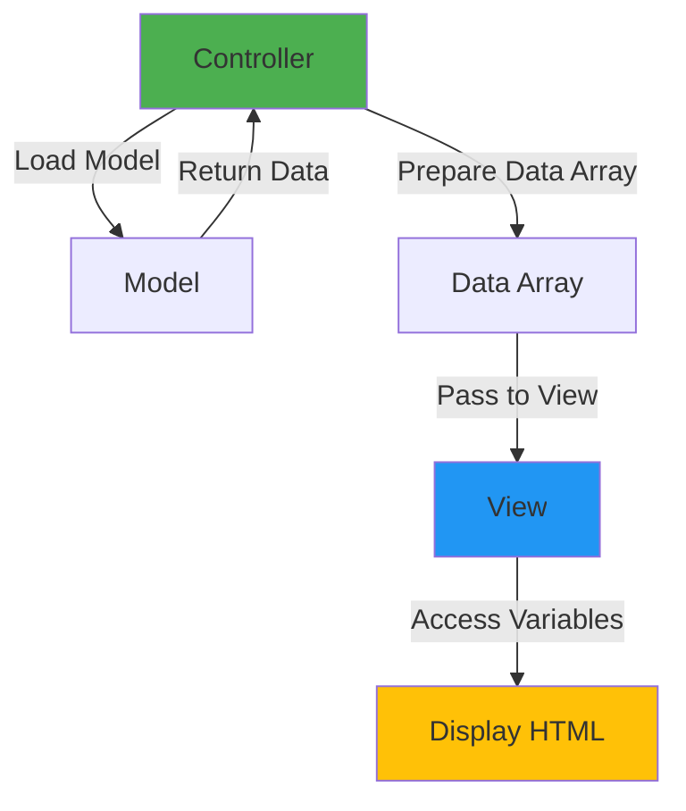

# 👁️ Phase 2 - View & Template

## 🎯 Learning Objectives

Setelah menyelesaikan phase ini, Anda akan:
- ✅ Memahami konsep View di MVC pattern
- ✅ Menguasai teknik passing data dari Controller ke View
- ✅ Membuat template system yang reusable
- ✅ Menggunakan PHP di View dengan best practices
- ✅ Mengorganisir View files dengan struktur yang baik
- ✅ Membuat dynamic content dengan data dari database

---

## 📋 Overview

View adalah **presentation layer** di CodeIgniter 3 - tempat dimana HTML, CSS, dan JavaScript hidup. View bertanggung jawab untuk menampilkan data ke user dengan format yang menarik dan user-friendly.

> 💡 **Analogi Sederhana:**  
> Jika Controller adalah **chef** 👨‍🍳 dan Model adalah **bahan makanan** 🥘,  
> maka View adalah **piring presentasi** 🍽️ yang membuat makanan terlihat menarik!

---

## 🎨 View vs PHP Native

### PHP Native (Mixed Logic & Presentation):
```php
<?php
// Everything mixed in one file
$conn = mysqli_connect(...);
$result = mysqli_query($conn, "SELECT * FROM products");
?>
<!DOCTYPE html>
<html>
<body>
    <h1>Products</h1>
    <?php while($row = mysqli_fetch_assoc($result)): ?>
        <div><?= $row['name'] ?> - $<?= $row['price'] ?></div>
    <?php endwhile; ?>
</body>
</html>
```

### CodeIgniter 3 (Separated):
```php
// Controller (logic)
class Product extends CI_Controller {
    public function index() {
        $data['products'] = $this->product_model->get_all();
        $this->load->view('product/list', $data);
    }
}

// View (presentation only)
<!DOCTYPE html>
<html>
<body>
    <h1>Products</h1>
    <?php foreach($products as $product): ?>
        <div><?= $product->name ?> - $<?= $product->price ?></div>
    <?php endforeach; ?>
</body>
</html>
```

**Keuntungan Separation:**
- ✅ Designer bisa fokus di View tanpa ganggu logic
- ✅ Logic changes tidak affect presentation
- ✅ Reusable views
- ✅ Easier debugging
- ✅ Better team collaboration

---

## 🗺️ What We'll Learn

<div style="display: grid; grid-template-columns: repeat(auto-fit, minmax(250px, 1fr)); gap: 20px; margin: 20px 0;">
  
  <div style="background: linear-gradient(135deg, #E3FDF5 0%, #FFE6FA 100%); border-left: 4px solid #00BFA5; padding: 20px; border-radius: 8px;">
    <h4>🎨 View Basics</h4>
    <p style="margin: 10px 0; color: #666;">Understanding View concept, location, and naming</p>
  </div>
  
  <div style="background: linear-gradient(135deg, #FCE4EC 0%, #F3E5F5 100%); border-left: 4px solid #E91E63; padding: 20px; border-radius: 8px;">
    <h4>📤 Loading Views</h4>
    <p style="margin: 10px 0; color: #666;">Different ways to load and display views</p>
  </div>
  
  <div style="background: linear-gradient(135deg, #E8F5E9 0%, #FFF9C4 100%); border-left: 4px solid #4CAF50; padding: 20px; border-radius: 8px;">
    <h4>📊 Data Passing</h4>
    <p style="margin: 10px 0; color: #666;">Send data from Controller to View</p>
  </div>
  
  <div style="background: linear-gradient(135deg, #E3F2FD 0%, #FFEBEE 100%); border-left: 4px solid #2196F3; padding: 20px; border-radius: 8px;">
    <h4>🔄 PHP in Views</h4>
    <p style="margin: 10px 0; color: #666;">Using PHP effectively in templates</p>
  </div>
  
  <div style="background: linear-gradient(135deg, #FFF3E0 0%, #F3E5F5 100%); border-left: 4px solid #FF9800; padding: 20px; border-radius: 8px;">
    <h4>🏗️ Template System</h4>
    <p style="margin: 10px 0; color: #666;">Building reusable template structure</p>
  </div>
  
  <div style="background: linear-gradient(135deg, #F3E5F5 0%, #E1F5FE 100%); border-left: 4px solid #9C27B0; padding: 20px; border-radius: 8px;">
    <h4>💻 Practice</h4>
    <p style="margin: 10px 0; color: #666;">Real-world view implementation</p>
  </div>
  
</div>

---

## 🏗️ View Architecture

### Typical View Structure:
```
application/views/
├── layouts/                 # Template layouts
│   ├── header.php
│   ├── footer.php
│   ├── sidebar.php
│   └── main.php
├── partials/               # Reusable components
│   ├── navigation.php
│   ├── breadcrumb.php
│   └── pagination.php
├── pages/                  # Static pages
│   ├── home.php
│   ├── about.php
│   └── contact.php
├── products/              # Product views
│   ├── list.php
│   ├── detail.php
│   └── form.php
├── auth/                  # Authentication views
│   ├── login.php
│   ├── register.php
│   └── forgot_password.php
└── errors/                # Error pages
    ├── 404.php
    └── 500.php
```

---

## 🔄 Data Flow to View



---

## 📊 Types of Data in Views

### 1. **Simple Variables**
```php
// Controller
$data['title'] = 'Welcome';
$data['user'] = 'John Doe';

// View
<h1><?= $title ?></h1>
<p>Hello, <?= $user ?>!</p>
```

### 2. **Arrays**
```php
// Controller
$data['colors'] = ['Red', 'Green', 'Blue'];

// View
<?php foreach($colors as $color): ?>
    <li><?= $color ?></li>
<?php endforeach; ?>
```

### 3. **Objects**
```php
// Controller
$data['product'] = $this->product_model->get(1);

// View
<h2><?= $product->name ?></h2>
<p>Price: $<?= $product->price ?></p>
```

### 4. **Multi-dimensional Data**
```php
// Controller
$data['categories'] = [
    'Electronics' => ['Phone', 'Laptop', 'TV'],
    'Clothing' => ['Shirt', 'Pants', 'Shoes']
];

// View
<?php foreach($categories as $category => $items): ?>
    <h3><?= $category ?></h3>
    <ul>
        <?php foreach($items as $item): ?>
            <li><?= $item ?></li>
        <?php endforeach; ?>
    </ul>
<?php endforeach; ?>
```

---

## 🎨 Template Strategies

### Strategy 1: Simple Include
```php
// Controller
$this->load->view('header');
$this->load->view('content');
$this->load->view('footer');
```

### Strategy 2: Master Layout
```php
// layouts/master.php
<!DOCTYPE html>
<html>
<head>
    <title><?= $title ?? 'My App' ?></title>
</head>
<body>
    <?php $this->load->view('partials/navbar'); ?>
    
    <main>
        <?php $this->load->view($content_view); ?>
    </main>
    
    <?php $this->load->view('partials/footer'); ?>
</body>
</html>

// Controller
$data['content_view'] = 'products/list';
$data['products'] = $this->product_model->get_all();
$this->load->view('layouts/master', $data);
```

### Strategy 3: Template Library
```php
// Create custom template library
class Template {
    protected $CI;
    
    public function __construct() {
        $this->CI =& get_instance();
    }
    
    public function render($view, $data = []) {
        $data['_content'] = $this->CI->load->view($view, $data, TRUE);
        $this->CI->load->view('template/main', $data);
    }
}

// Controller usage
$this->template->render('products/list', [
    'products' => $products
]);
```

---

## 💡 Best Practices

### 1. **Keep Logic Out of Views**
```php
// ❌ Bad - Logic in view
<?php
$discount = $product->price * 0.1;
$final_price = $product->price - $discount;
?>
<p>Price: $<?= $final_price ?></p>

// ✅ Good - Logic in controller/model
// Controller
$data['product']->final_price = $this->product_model->calculate_price($product);

// View
<p>Price: $<?= $product->final_price ?></p>
```

### 2. **Use Alternative PHP Syntax**
```php
// ❌ Traditional syntax (harder to read in HTML)
<?php if($logged_in) { ?>
    <p>Welcome!</p>
<?php } else { ?>
    <p>Please login</p>
<?php } ?>

// ✅ Alternative syntax (cleaner)
<?php if($logged_in): ?>
    <p>Welcome!</p>
<?php else: ?>
    <p>Please login</p>
<?php endif; ?>
```

### 3. **Escape Output**
```php
// ❌ Dangerous - XSS vulnerable
<p><?= $user_input ?></p>

// ✅ Safe - Escaped output
<p><?= html_escape($user_input) ?></p>
<p><?= htmlspecialchars($user_input, ENT_QUOTES, 'UTF-8') ?></p>
```

### 4. **Organize View Files**
```php
// ❌ Bad - All views in root
views/
├── header.php
├── footer.php
├── product_list.php
├── product_detail.php
├── user_profile.php
└── user_settings.php

// ✅ Good - Organized by feature
views/
├── layouts/
├── products/
│   ├── list.php
│   └── detail.php
└── users/
    ├── profile.php
    └── settings.php
```

---

## 🎯 Common View Patterns

### 1. **List View**
```php
<!-- products/list.php -->
<div class="products">
    <?php if(empty($products)): ?>
        <p>No products found.</p>
    <?php else: ?>
        <?php foreach($products as $product): ?>
            <div class="product-card">
                <h3><?= html_escape($product->name) ?></h3>
                <p>$<?= number_format($product->price, 2) ?></p>
                <a href="<?= site_url('product/detail/'.$product->id) ?>">View</a>
            </div>
        <?php endforeach; ?>
    <?php endif; ?>
</div>
```

### 2. **Detail View**
```php
<!-- products/detail.php -->
<article class="product-detail">
    <h1><?= html_escape($product->name) ?></h1>
    image) ?>" alt="<?= html_escape($product->name) ?>">
    <p class="price">$<?= number_format($product->price, 2) ?></p>
    <div class="description">
        <?= nl2br(html_escape($product->description)) ?>
    </div>
    <button onclick="addToCart(<?= $product->id ?>)">Add to Cart</button>
</article>
```

### 3. **Form View**
```php
<!-- products/form.php -->
<?= form_open('product/save') ?>
    <div class="form-group">
        <label>Product Name</label>
        <input type="text" name="name" value="<?= set_value('name', $product->name ?? '') ?>" class="form-control">
        <?= form_error('name', '<small class="text-danger">', '</small>') ?>
    </div>
    
    <div class="form-group">
        <label>Price</label>
        <input type="number" name="price" value="<?= set_value('price', $product->price ?? '') ?>" class="form-control">
        <?= form_error('price', '<small class="text-danger">', '</small>') ?>
    </div>
    
    <button type="submit" class="btn btn-primary">Save</button>
<?= form_close() ?>
```

---

## 📈 Performance Tips

### 1. **View Caching**
```php
// Enable view caching (in minutes)
$this->output->cache(60); // Cache for 60 minutes
```

### 2. **Minimize View Logic**
```php
// Move complex logic to helpers
// helpers/format_helper.php
function format_price($price) {
    return '$' . number_format($price, 2);
}

// View
<?= format_price($product->price) ?>
```

### 3. **Load Views as String**
```php
// For email templates or AJAX responses
$html = $this->load->view('email/welcome', $data, TRUE);
// Third parameter TRUE returns view as string
```

---

## 🎯 Success Metrics

Anda berhasil menguasai Phase 2 jika bisa:

- [ ] Membuat dan organize view files
- [ ] Pass berbagai jenis data ke view
- [ ] Menggunakan PHP alternative syntax
- [ ] Membuat template system
- [ ] Handle empty data gracefully
- [ ] Escape output untuk security
- [ ] Membuat reusable view components
- [ ] Score ≥ 80% di quiz

---

## 🚀 What You'll Build

### Mini Project: "Blog Template System"
```
Features:
✅ Master layout template
✅ Dynamic header/footer
✅ Blog post list view
✅ Blog detail view
✅ Comment section
✅ Sidebar widgets
✅ Pagination view
✅ Search results view
```

---

## 📚 Phase Contents

1. **[🎨 Understanding Views](view-concept.md)**  
   Konsep dan filosofi View di MVC

2. **[📤 Loading Views](loading-views.md)**  
   Berbagai cara load dan display view

3. **[📊 Passing Data](passing-data.md)**  
   Teknik passing data Controller → View

4. **[🔄 PHP in Views](php-in-views.md)**  
   Best practices PHP di template

5. **[🏗️ Template System](template-system.md)**  
   Membuat reusable template structure

6. **[💻 Practice Lab](practice.md)**  
   Hands-on exercises

7. **[❓ Quiz](quiz.md)**  
   Test your knowledge

---

<div style="display: flex; justify-content: space-between; margin-top: 40px;">
  <div>
    <a href="../phase-1-controller/quiz.md" style="text-decoration: none;">
      <button style="background: #6c757d; color: white; padding: 10px 20px; border: none; border-radius: 5px; cursor: pointer;">
        ← Previous: Phase 1 Quiz
      </button>
    </a>
  </div>
  <div>
    <a href="view-concept.md" style="text-decoration: none;">
      <button style="background: #4CAF50; color: white; padding: 10px 20px; border: none; border-radius: 5px; cursor: pointer;">
        Next: Understanding Views →
      </button>
    </a>
  </div>
</div>

---

<p align="center">
  <strong>👁️ Let's make beautiful views!</strong><br/>
  <em>"A good view is worth a thousand words"</em>
</p>
