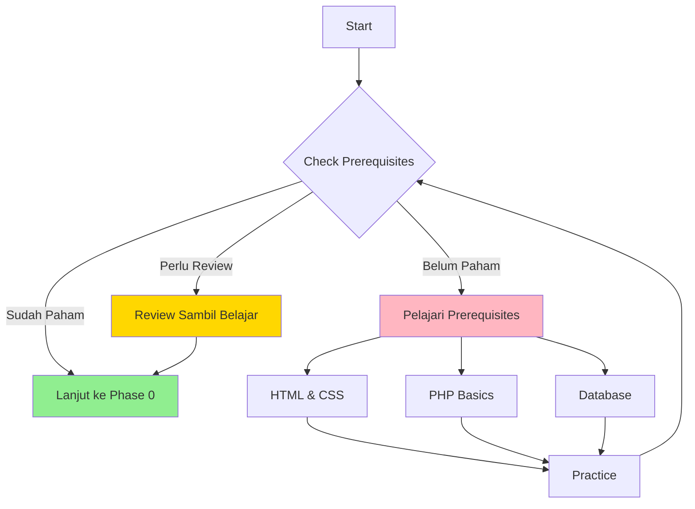

# 📋 Prerequisite

## 🎯 Overview

Sebelum memulai pembelajaran CodeIgniter 3, ada beberapa **pengetahuan dasar** yang perlu dikuasai. Phase ini akan memastikan Anda memiliki fondasi yang kuat untuk melanjutkan ke materi framework.

<div style="background: linear-gradient(135deg, #667eea 0%, #764ba2 100%); padding: 20px; border-radius: 10px; color: white; margin: 20px 0;">

💡 **Sudah yakin dengan prerequisite?**  
Langsung ambil [Self-Assessment Quiz](self-assessment.md) untuk mengukur kesiapan Anda!

</div>

---

## 📚 Apa yang Perlu Dikuasai?

<div style="display: grid; grid-template-columns: repeat(auto-fit, minmax(280px, 1fr)); gap: 20px; margin: 25px 0;">

<div style="background: #E3F2FD; padding: 20px; border-radius: 10px; border-left: 4px solid #2196F3;">
<h3>🌐 Web Development Basics</h3>
<p>Pemahaman dasar tentang bagaimana web bekerja:</p>
<ul>
<li><strong>HTTP Protocol</strong> - Request & Response</li>
<li><strong>Client-Server Architecture</strong></li>
<li><strong>Web Browser & Web Server</strong></li>
<li><strong>URL Structure</strong></li>
</ul>
<a href="web-basics.md" style="color: #1976D2; font-weight: bold;">📖 Pelajari Web Basics →</a>
</div>

<div style="background: #E8F5E9; padding: 20px; border-radius: 10px; border-left: 4px solid #4CAF50;">
<h3>🐘 PHP Programming</h3>
<p>Penguasaan PHP dasar hingga menengah:</p>
<ul>
<li><strong>Variables & Data Types</strong></li>
<li><strong>Arrays</strong> - Indexed & Associative</li>
<li><strong>Functions</strong> - Built-in & Custom</li>
<li><strong>OOP Basics</strong> - Class, Object, Method</li>
</ul>
<a href="php-fundamentals.md" style="color: #388E3C; font-weight: bold;">📖 Pelajari PHP Fundamentals →</a>
</div>

<div style="background: #FFF3E0; padding: 20px; border-radius: 10px; border-left: 4px solid #FF9800;">
<h3>💾 Database & SQL</h3>
<p>Kemampuan mengelola database:</p>
<ul>
<li><strong>Database Concepts</strong> - Table, Row, Column</li>
<li><strong>SQL Commands</strong> - SELECT, INSERT, UPDATE, DELETE</li>
<li><strong>Relationships</strong> - Primary Key, Foreign Key</li>
<li><strong>phpMyAdmin</strong> - Basic usage</li>
</ul>
<a href="database-basics.md" style="color: #F57C00; font-weight: bold;">📖 Pelajari Database Basics →</a>
</div>

<div style="background: #FCE4EC; padding: 20px; border-radius: 10px; border-left: 4px solid #E91E63;">
<h3>🛠️ Development Tools</h3>
<p>Familiar dengan tools development:</p>
<ul>
<li><strong>Local Server</strong> - XAMPP/Laragon/MAMP</li>
<li><strong>Code Editor</strong> - VS Code</li>
<li><strong>Browser DevTools</strong> - Inspect & Debug</li>
<li><strong>File Management</strong> - Directory structure</li>
</ul>
<a href="tools-setup.md" style="color: #C2185B; font-weight: bold;">📖 Setup Development Tools →</a>
</div>

</div>

---

## 📊 Self-Assessment Checklist

Gunakan checklist ini untuk menilai kesiapan Anda:

### HTML & CSS
- [ ] Bisa membuat form HTML dengan berbagai input type
- [ ] Paham perbedaan GET dan POST method
- [ ] Bisa styling dengan CSS (class, id, inline)
- [ ] Mengerti box model (margin, padding, border)

### PHP Basics
- [ ] Bisa membuat dan menggunakan variabel
- [ ] Paham array indexed dan associative
- [ ] Bisa membuat dan memanggil function
- [ ] Mengerti konsep include dan require
- [ ] Paham $_GET, $_POST, $_SESSION

### PHP OOP
- [ ] Mengerti konsep class dan object
- [ ] Bisa membuat class dengan properties dan methods
- [ ] Paham visibility (public, private, protected)
- [ ] Mengerti inheritance dasar

### Database & SQL
- [ ] Bisa membuat database dan tabel
- [ ] Menulis query SELECT dengan WHERE
- [ ] Melakukan INSERT, UPDATE, DELETE
- [ ] Paham konsep Primary Key
- [ ] Bisa menggunakan phpMyAdmin

### Development Environment
- [ ] Sudah install XAMPP/Laragon/MAMP
- [ ] Bisa menjalankan localhost
- [ ] Familiar dengan struktur folder htdocs/www
- [ ] Bisa menggunakan code editor

---

## 🚦 Status Check

Berdasarkan checklist di atas, tentukan level Anda:

### 🟢 **Ready to Go** (80-100% checked)
Anda siap melanjutkan ke Phase 0! Prerequisite sudah cukup kuat.

### 🟡 **Need Review** (50-79% checked)
Review materi yang belum dikuasai sambil mengikuti modul ini.

### 🔴 **Need Preparation** (< 50% checked)
Sebaiknya pelajari dulu prerequisite sebelum melanjutkan.

---

## 📖 Quick Learning Resources

Jika perlu mempelajari prerequisite, berikut resources yang recommended:

### HTML & CSS
- 📺 [HTML Crash Course - YouTube](https://www.youtube.com/results?search_query=html+crash+course)
- 📖 [MDN Web Docs - HTML](https://developer.mozilla.org/en-US/docs/Web/HTML)
- 🎮 [FreeCodeCamp - Responsive Web Design](https://www.freecodecamp.org/learn/responsive-web-design/)

### PHP
- 📺 [PHP Tutorial for Beginners - YouTube](https://www.youtube.com/results?search_query=php+tutorial+beginners)
- 📖 [PHP Manual](https://www.php.net/manual/en/)
- 🎮 [W3Schools PHP Tutorial](https://www.w3schools.com/php/)

### Database & SQL
- 📺 [MySQL Tutorial - YouTube](https://www.youtube.com/results?search_query=mysql+tutorial)
- 📖 [MySQL Documentation](https://dev.mysql.com/doc/)
- 🎮 [SQLBolt - Interactive SQL](https://sqlbolt.com/)

### Development Tools
- 📺 [XAMPP Installation Guide](https://www.youtube.com/results?search_query=xampp+installation)
- 📖 [VS Code Documentation](https://code.visualstudio.com/docs)

---

## 🎯 Learning Path



---

## 💪 Minimum Project Experience

Sebelum lanjut, pastikan pernah membuat minimal:

### 📝 Project 1: Form Processing
```php
// Simple form yang bisa:
- Menerima input user
- Validasi sederhana
- Simpan ke database
- Tampilkan data
```

### 🔐 Project 2: Login System
```php
// Login sederhana dengan:
- Form login
- Cek username/password
- Session management
- Logout functionality
```

### 📊 Project 3: CRUD Application
```php
// Aplikasi CRUD untuk:
- Create data
- Read/Display data
- Update data
- Delete data
```

---

## ✅ Ready Checklist

Sebelum melanjutkan ke Phase 0, pastikan:

- [ ] **Environment Ready** - XAMPP/Laragon terinstall dan berjalan
- [ ] **Editor Ready** - VS Code atau editor pilihan terinstall
- [ ] **Database Ready** - MySQL bisa diakses via phpMyAdmin
- [ ] **Browser Ready** - Chrome/Firefox dengan DevTools
- [ ] **Mindset Ready** - Siap belajar dan praktik

---

## 🚀 Next Step

Sudah siap? Mari mulai perjalanan CodeIgniter 3!

<div style="display: flex; justify-content: space-between; margin-top: 40px;">
  <div>
    <!-- Previous button disabled on first page -->
  </div>
  <div>
    <a href="../phase-0-setup/README.md" style="text-decoration: none;">
      <button style="background: #4CAF50; color: white; padding: 10px 20px; border: none; border-radius: 5px; cursor: pointer;">
        Next: Phase 0 - Environment & Setup →
      </button>
    </a>
  </div>
</div>

---

<p align="center">
  <em>"A journey of a thousand miles begins with a single step" - Lao Tzu</em>
</p>
